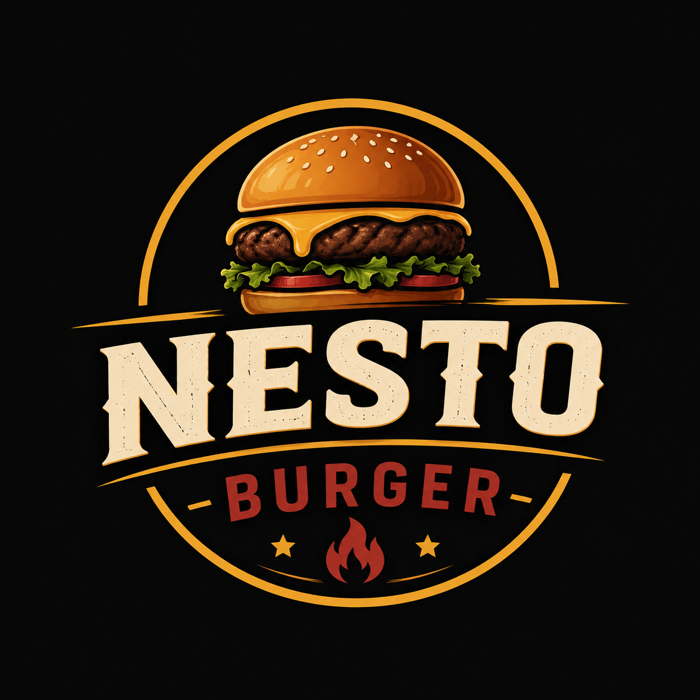

<div align="center">



# Nesto Burgers

**A bilingual (Arabic / English) online storefront for a burger restaurant in Nablus.**
Browse the menu, build a cart, and send the order straight to WhatsApp.


</div>

---

## Overview

Nesto Burgers is a single-page application that presents a restaurant's menu, offers and story, and lets customers place an order without a backend: the cart is turned into a pre-filled WhatsApp message addressed to the restaurant.

The interface is fully bilingual. Arabic is the default and renders right-to-left; switching to English flips the layout direction, page title and all copy.

## Features

- **Menu** with live search, category filters (burgers, sides, drinks, combos) and an add-to-cart confirmation state. The filter bar stays pinned while scrolling.
- **Cart drawer** with quantity controls, running total, and persistence across reloads (`localStorage`).
- **WhatsApp checkout**: the cart is formatted into a localized order message and opened in WhatsApp.
- **Offers** with discount badges, click-to-copy promo codes, and a one-tap "order this deal" action.
- **Gallery** with category filters and a lightbox viewer.
- **Reviews** with an auto-advancing highlight slider and a star-rating form.
- **Contact** page with form validation, quick WhatsApp chat, and an embedded map.
- **Bilingual + RTL**: language is remembered between visits; `lang`, `dir` and `document.title` update on switch.
- **Responsive**: sticky navbar with a full-screen mobile drawer, fluid grids, touch-friendly gallery captions.
- **Accessible defaults**: visible keyboard focus, ARIA labels on icon buttons, and `prefers-reduced-motion` support.

## Tech stack

| Area | Choice |
| --- | --- |
| UI | React 19 |
| Routing | React Router 7 |
| Build tool | Vite 8 |
| Styling | Hand-written CSS with design tokens (Tailwind CSS 4 is installed via `@tailwindcss/vite`) |
| Icons | Font Awesome 6 (CDN) and `react-icons` |
| Fonts | Tajawal (Google Fonts) |
| Linting | Oxlint |

## Getting started

**Prerequisites:** Node.js 18+ and npm.

```bash
# clone
git clone https://github.com/Abdullah-m-sh100/Nesto-Burgers.git
cd Nesto-Burgers

# install dependencies
npm install

# start the dev server (http://localhost:5173)
npm run dev
```

### Scripts

| Command | Description |
| --- | --- |
| `npm run dev` | Start the Vite dev server with hot reload |
| `npm run build` | Create a production build in `dist/` |
| `npm run preview` | Serve the production build locally |
| `npm run lint` | Run Oxlint |

## Project structure

```
src/
├── App.jsx               # Providers, router, and page shell
├── main.jsx              # Entry point
├── index.css             # Design tokens, global styles, ambient background
├── components/           # Navbar, Footer, CartModal (each with its own CSS)
├── pages/                # Home, Menu, Offers, About, Gallery, Reviews, Contact
├── context/
│   ├── LanguageContext   # Language state, RTL/LTR handling, t("section.key")
│   └── CartContext       # Cart state, totals, localStorage persistence
├── data/
│   ├── products.js       # Menu catalog and offers (bilingual fields)
│   └── translations.js   # All UI copy for `en` and `ar`
└── assets/               # Logo and product images
```

## Customizing

- **Menu items and offers:** edit `src/data/products.js`. Each item carries `{ en, ar }` names and descriptions.
- **UI text:** edit `src/data/translations.js`. Every new string needs both an `en` and an `ar` entry; `t()` returns the key itself when a translation is missing.
- **Brand colors, spacing and type scale:** change the CSS variables at the top of `src/index.css`.
- **Order destination:** the WhatsApp number is set where the order links are built (`CartModal.jsx`, `Offers.jsx`, `Contact.jsx`, `Footer.jsx`).

## Notes

- The menu, offers and reviews are static data; there is no server or database. Reviews and contact-form submissions added in the browser are not persisted.
- Pushing to `main` does not deploy automatically; build with `npm run build` and host the `dist/` folder on any static host.

## License

No license has been specified for this repository. All rights reserved by the author unless one is added.
